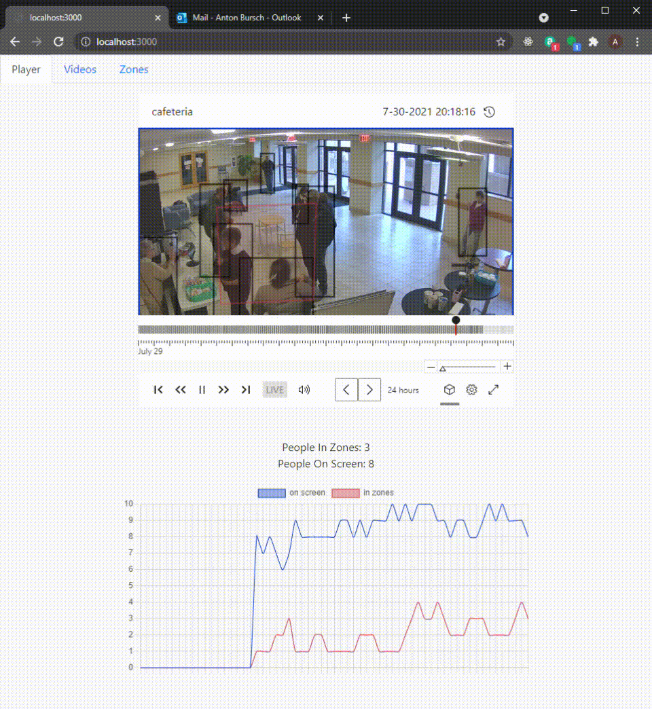
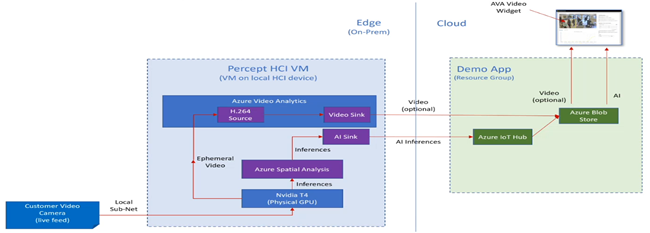
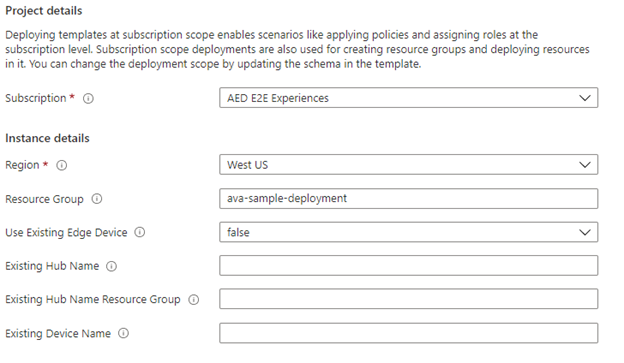
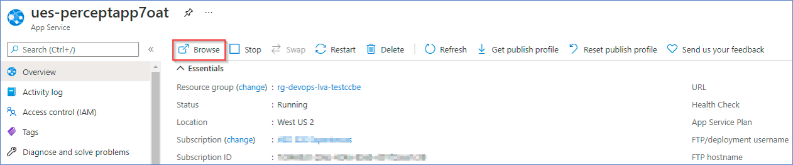
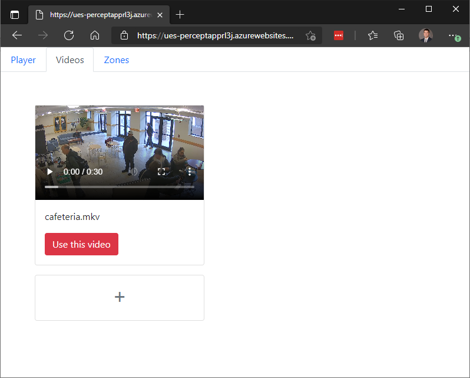

# Azure Percept Testdrive
		
## Overview

This is an open-source Azure Percept Testdrive solution providing a virtualized edge inferencing with user-defined zone entry/exit events. Video and AI output from the virtualized edge device is egressed to Azure Data Lake using Azure Video Analyzer and IoT Hub, with the user interface running as an Azure Website. AI inferencing is provided by Azure Spatial Analysis for people detection:

## App topology

### Device Requirements
This application requires an Azure Subscription with sufficient (>=4 vCPU) quota for the NCasT4_v3 Azure VM series.

# Installation Details
This open-source reference solution showcases best practices for AI security, privacy and compliance.  It is intended to be immediately useful for anyone to use for a virtualized Percept deployment experience in Azure and later for Azure Stack HCI deployments. 

## Prerequisites
- You must have owner access on the Azure subscription you wish to deploy to

- You must have available quota for 4 vCPUs of the NCasT4_v3 Azure VM series which is equipped with the Nvidia Tesla T4 GPU required by Spatial Analysis inferencing service.

- This deployment will create resources within the following Azure namespaces. These resource providers must be enabled on the subscription.
    * Microsoft.Devices
    * Microsoft.Authorization
    * Microsoft.ContainerInstance
    * Microsoft.ManagedIdentity
    * Microsoft.Web
    * Microsoft.Storage
    * Microsoft.Resources
    * Microsoft.Media

---

## App Deployment
Deployment starts with this button. Please reference the below details for populating the requested deployment information.

This will redirect you to the Azure portal with this deployment page:

#

To deploy this reference solution, please enter the following parameters:

|Parameter|Required (Y/N)|Description|
|---|---|---|
|__Region__|Y|Region to use for template deployment. This is currently restricted to regions which support the NCasT4_V3 virtual machines. Please check [Azure Products by Region](https://azure.microsoft.com/en-us/global-infrastructure/services/?products=virtual-machines&regions=all) for region availability.|
|__Resource Group__|Y|The name of the resource group for deploying new resources|
|__Use Existing Edge Device__|Optional|If true, this deployment will override the modules that are currently deployed on the specified device|
|__Existing Hub Name__|Optional|An (optional) existing IoT Hub to use instead of creating a new one.|
|__Existing Hub Name Resource Group__|Optional|The resource group name of the existing IoT Hub if specified.|
|__Existing Device Name__|Optional|An (optional) existing edge device to use instead of creating a simulated device. It is expected to already be registered with the specified existing hub|

Once deployment is complete, you can launch the web application by navigating to the `Resource Group` name selected above. You will see an Azure Web Services deployment which starts with `ues-perceptapp` followed by 4 random characters. Select this app, then chose the `Browse` button in the top left:

# Uploading a custom video

At this time only h.264 MKV files are supported for custom video upload functionality. The uploaded video will be downsampled to 15 FPS to ensure smooth playback functionality in the frontend application. 

To upload a custom video: 
- Select the `Videos` tab of the application. 
- Drag an h.264 MKV file onto the `+` icon (see image below) to load the video to the application. (After uploading, you will see a playback thumbnail for previewing your video)
- Click the `Use this video` button and select `OK` to confirm that you would like to replace the curent video on the `Player` tab.
- Refresh the application to begin viewing your new custom video

> NOTE: Please note that it can take up to 5 minutes for AVA to begin displaying the updated video feed in the front-end application. You may need to refresh your browser window for the application to reflect the changes. A smoother experience is planned in a future release of the application.

---
# Troubleshooting Common Deployment Errors

**Issue:** Role assignment step failed

This can occur when the managed identity conflict exists for the resource group. This is typically encountered if you have deployed the solution with the same resource group name in the past.

**Resolution:**

Give your resource group a different name and try deploying again

**Issue:** Object reference not set to an instance of an object.

This deployment error is an intermittent issue which is typically resolved by redeploying the solution

**Resolution:**

Delete the existing resource groups that were partially created and redeploy the ARM template again with a new resource group name