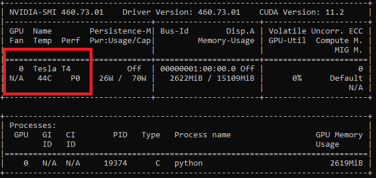

# Video Downloader module

The Video Downloader module downloads the video from link and after downloading it converts the video to 15fps as an direct method request.


## Contents

| File/folder             | Description                                                   |
|-------------------------|---------------------------------------------------------------|
| `.gitignore`            | Define what to ignore at commit time.                         |
| `README.md`             | This README file.                                             |
| `modules.json`       | JSON file defining container registry configuration.|
| `main.py`               | The main program file                                         |
| `requirements.txt`      | List of all dependent Python libraries                        |


## Setup

Create a file named `.env` in the `modules/videoDownlader` folder and add the following text to it.Provide values for all variables.

```env
CONTAINER_REGISTRY_USERNAME_myacr="<user name for your Azure Container Registry>"
CONTAINER_REGISTRY_PASSWORD_myacr="<password for the registry>"
```

### Prerequisites
* To run the videoDownloader container you need a compute device with [NVIDIA Tesla T4 GPU](https://www.nvidia.com/en-us/data-center/tesla-t4/). However the container runs on any other desktop machine that meets the minimum requirements.

Follow these instructions:

#### Minimum hardware requirements

* 4 GB system RAM
* 4 GB of GPU RAM
* 8 core CPU
* 1 NVIDIA Tesla T4 GPU
* 20 GB of HDD space

#### Recommended hardware

* 32 GB system RAM
* 16 GB of GPU RAM
* 8 core CPU
* 2 NVIDIA Tesla T4 GPUs
* 50 GB of SSD space

#### Install NVIDIA CUDA Toolkit and Nvidia graphics drivers on the host computer

Use the following bash script to install the required Nvidia graphics drivers, and CUDA Toolkit.

```bash
wget https://developer.download.nvidia.com/compute/cuda/repos/ubuntu1804/x86_64/cuda-ubuntu1804.pin
sudo mv cuda-ubuntu1804.pin /etc/apt/preferences.d/cuda-repository-pin-600
sudo apt-key adv --fetch-keys https://developer.download.nvidia.com/compute/cuda/repos/ubuntu1804/x86_64/7fa2af80.pub
sudo add-apt-repository "deb http://developer.download.nvidia.com/compute/cuda/repos/ubuntu1804/x86_64/ /"
sudo apt-get update
sudo apt-get -y install cuda
```

Reboot the machine, and run the following command.

```bash
nvidia-smi
```

You should see the following output.



### Install Docker CE and nvidia-docker2 on the host computer

Install Docker CE on the host computer.

```bash
sudo apt-get update
sudo apt-get install -y apt-transport-https ca-certificates curl gnupg-agent software-properties-common
curl -fsSL https://download.docker.com/linux/ubuntu/gpg | sudo apt-key add -
sudo add-apt-repository "deb [arch=amd64] https://download.docker.com/linux/ubuntu $(lsb_release -cs) stable"
sudo apt-get update
sudo apt-get install -y docker-ce docker-ce-cli containerd.io
```

Install the *nvidia-docker-2* software package.

```bash
distribution=$(. /etc/os-release;echo $ID$VERSION_ID)
curl -s -L https://nvidia.github.io/nvidia-docker/gpgkey | sudo apt-key add -
curl -s -L https://nvidia.github.io/nvidia-docker/$distribution/nvidia-docker.list | sudo tee /etc/apt/sources.list.d/nvidia-docker.list
sudo apt-get update
sudo apt-get install -y docker-ce nvidia-docker2
sudo systemctl restart docker
```

### Building, publishing and running the Docker container

To build the image, use the Docker file named `Dockerfile`.

First, a couple assumptions

* We'll be using Azure Container Registry (ACR) to publish our image before distributing it
* Our local Docker container image is already logged into ACR.
* In this sample, our ACR name is "myregistry". Your name may defer, so please update it properly in the following commands.

> If you're unfamiliar with ACR or have any questions, please follow this [demo on building and pushing an image into ACR](https://docs.microsoft.com/en-us/azure/container-registry/container-registry-get-started-docker-cli).

`cd` onto the video downloader root directory 

```
sudo docker build -f Dockerfile -t video-downloader:latest .

sudo docker tag video-downloader:latest myregistry.azurecr.io/video-downloader:1

sudo docker push myregistry.azurecr.io/video-downloader:1
```

Then, from the box where the container should execute, run this command:

`sudo docker run -d -p 5678:5678 --name video-downloader myregistry.azurecr.io/video-downloader:1 --gpus all -p 5678`

Let's decompose it a bit:

* `-p 5678:5678`: it's up to you where you'd like to map the containers 5001 port. You can pick whatever port fits your needs.
* `--name`: the name of the running container.
* `registry/image:tag`: replace this with the corresponding location/image:tag where you've pushed the image built from the `Dockerfile`
* `-p`: the port the http extension server will listen on


Terminate the container using the following Docker commands

```bash
docker stop video-downloader
docker rm video-downloader
```

## Upload Docker image to Azure container registry

Follow instructions in [Push and Pull Docker images  - Azure Container Registry](http://docs.microsoft.com/en-us/azure/container-registry/container-registry-get-started-docker-cli) to save your image for later use on another machine.

## Deploy as an Azure IoT Edge module

Follow instruction in [Deploy module from Azure portal](https://docs.microsoft.com/en-us/azure/iot-edge/how-to-deploy-modules-portal) to deploy the container image as an IoT Edge module (use the IoT Edge module option).
